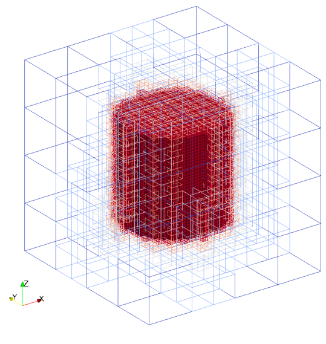

title: STL

Stl files can be used as geometry kind. At first, seeder loads the 
triangles from stl files to the temporary stl_data type and
then each triangle in the stl_data is converted to sdr_triangle_type.
Stl geometry requires filename and stl file format. If file format
is not provided, default is set to binary.
Valid definition:

* Single stl
```lua
geometry={
  kind='stl', 
    object={
      filename='cube.stl',
      format = 'ascii' -- if not provided, default is binary
    }
}
```

* Multiple stls
```lua
geometry={
  kind='stl', 
    object={
      {
      filename = 'cube.stl'
      },
      {
      filename = 'cylinder.stl'
      }
    }
}
``` 

Seeder file to create mesh with single 'stl' geometry:

\include testsuite/stl/seeder.lua

Mesh with 'stl' geometry created by seeder file:



Example lua file is available at `testsuite/stl/seeder.lua`
