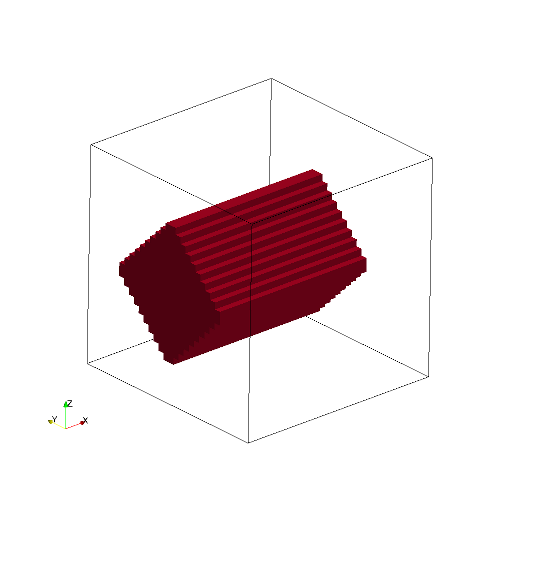
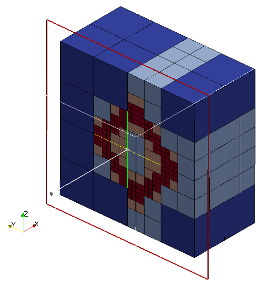
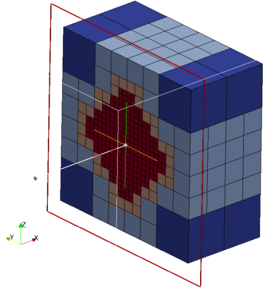

title: Box

Boxes are defined by an origin and three vectors.
Box is considered to be solid as default i.e. all the cubes inside the
box are marked as intersected cubes. 
It is possible to created hollow boxes by setting `only_surface = true`,
it will mark only the cubes intersect with sphere surface as intersected
cubes. Hollow box is created by converting box definion to triangles
internally and do triangle cube intersection.

Seeder supports non-axis aligned oriented boxes.

Valid definition:

* Single box
```lua
geometry={
  kind='canoND', 
    object={
      origin={0.0,0.0,0.0},
      vec = {
        { 0.0,0.5,0.0},
        { 0.2,0.0,0.0},
        { 0.0,0.0,0.8}
      }
      only_surface = true, -- If not defined default is set to false
    }
}
```

* Rotated box
```lua
geometry={
  kind='canoND', 
    object={
      {
      origin={0.0,0.0,0.0},
       vec = { { 0.0, 
                 0.4*math.cos(45*math.pi/180), 
                 -0.4*math.sin(45*math.pi/180) },
               { 0.8, 0.0, 0.0 },
               { 0.0, 
                 0.4*math.sin(45*math.pi/180), 
                 0.4*math.cos(45*math.pi/180) },
       }, -- box rotated along x-axis in anti-clockwise direction by 45°
      }
    }
} 
```

Seeder file to generate the mesh with box
```lua

folder = 'mesh/'
comment = 'box'
minlevel = 2

level = 2  -- number of levels are two

-- Debug output can be used to output preliminary tree in restart format
-- and this restart file can be converted to vtu format by harvester.

debug = {debugMode=true, debugFiles=true, debugMesh='debug/'}

-- boundingbox: two entries: origin and length in this
-- order, if no keys are used
bounding_cube = { origin = {-2.0, -2.0, -2.0}, length = 4.0 }


-- Each spatial object is defined by an attribute and some geometric
-- entity attached to this attribute. Attribute might be defined mulitple times.
-- Attributes are described by a kind (boundary ,seed or Refinement) a level
spatial_object = {
         { attribute = { kind = 'seed', label = 'seed', },

-- Geometric objects might by right now:
-- canoND (point, line, plane or box)
-- STL
geometry = {
              kind = 'canoND',
                   object = { origin = { -1.8,-1.8 , -1.8 }
                           }
              } 
 },   -- seed

-- defining the attribute and geometry of the box

    { attribute = { kind = 'boundary', label = 'solid', level=3 },

      geometry = {
         kind = 'canoND',
         object = {
           origin = { 0.0 , 0.0 , 0.0 },
           vec = {
             { 0.0 , 0.5 , 0.0 },
             { 0.2 , 0.0 , 0.0 },
             { 0.0 , 0.0 , 0.8 }
           },
           only_surface = true,
         }
      }
   } 
} -- spatial object

```

A box can also be defined by two planes
```lua

printRuntimeInfo = false

comment = 'box'
minlevel = 2
-- Use this file as template. Do not modify this file for running some testcases
-- Location to write the mesh in
-- Note the trailing path seperator, needed, if all mesh files should be
-- directory. This directory has to exist before running Seeder in this
-- case
folder = 'mesh/'

level = 6      --number of levels are six

--Debug output can be used to output preliminary tree in restart format
--and this restart file can be converted to vtu format by harvester.
debug = {debugMode=true, debugFiles=true, debugMesh='debug/'}

-- boundingbox: two entries: origin and length in this
-- order, if no keys are used
bounding_cube = { origin = {-2.0, -2.0, -2.0}, length = 4.0 }  

-- Each spatial object is defined by an attribute and some geometric
-- entity attached to this attribute. Attribute might be defined mulitple times.
-- Attributes are described by a kind (boundary ,seed or Refinement) a level
    spatial_object = {
   { attribute = { kind = 'seed', label = 'seed', }, -- kind and lable are 'seed'
    
-- Geometric objects might by right now:
-- canoND (point, line, plane or box)
-- STL
      geometry = {
      kind = 'canoND',
      object = { origin = { 0.0, 0.0, 0.0 },
      }
    }
  }, -- seed
  --------------------------------------------
-- defining the attribute and geometry for the left wall
 
  { attribute = {
      kind = 'boundary', label = 'left_wall',
      level = level, calc_dist = false,
    },
    geometry = {
      kind = 'canoND',
      object = {
        origin = { -2.0, -2.0, -1.8 },
        vec = {  {  4.0,  0.0,  0.0 },
                 {  0.0,  4.0,  0.0 },
              },
        only_surface = true,
               } -- object
               },
  },
  --------------------------------------------
-- defining the attribute for the right wall

    { attribute = {               
      kind = 'boundary', label = 'right_wall',
      level = level, calc_dist = false,
    },
    geometry = {
      kind = 'canoND',
      object = {
        origin = { -2.0, -2.0, 1.4 },
        vec =  { {  4.0,  0.0, 0.0 },
                 {  0.0,  4.0, 0.0 },
        },
        only_surface = true,
      } -- object
    },
  }, -- right_wall
} -- spatial object
```

Mesh with hollow box (Hollow => only_surface = true)



Cutview of Mesh with hollow box



Mesh generated with solid box (Solid => only_surface = false)

Cutview of Mesh with solid box



Example lua file is available at `testsuite/box/seeder.lua`
