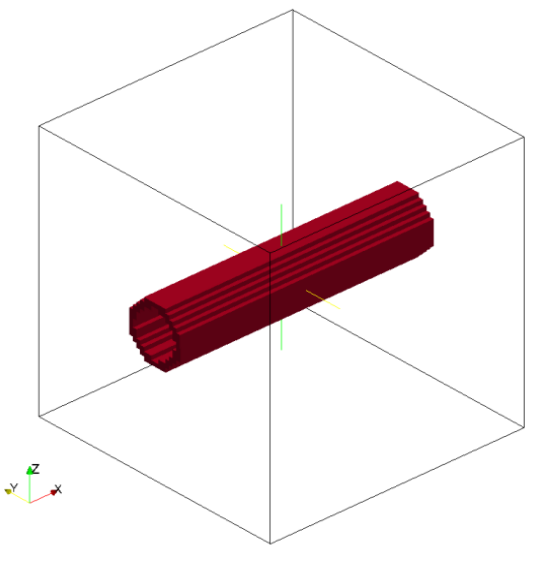
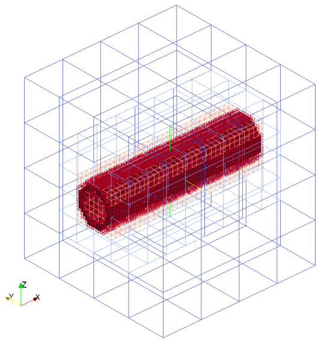
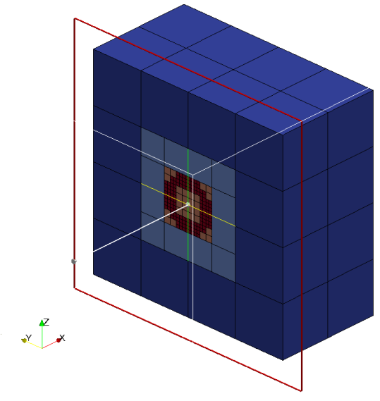
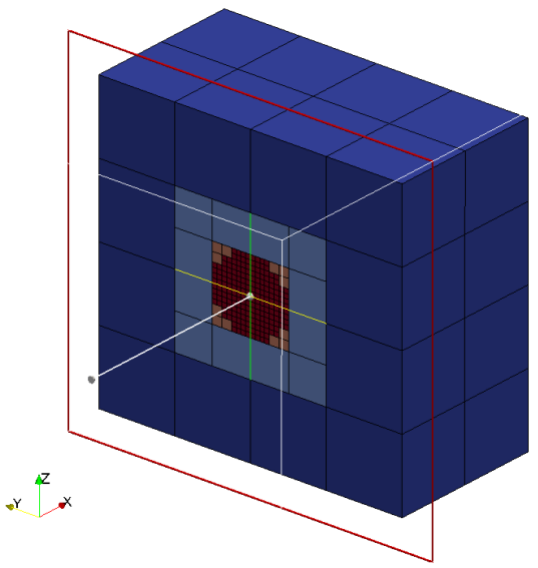

title: Cylinders

Cylinders are defined by an origin, vector defining the length and the
axis and the radius.
Cylinder is considered to be solid as default i.e. all the cubes inside the
cylinder are marked as intersected cubes. 
It is possible to created hollow cylinders by setting `only_surface = true`,
it will mark only the cubes intersect with cylinder surface as intersected
cubes

Valid definition:

* Single cylinder
```lua
geometry={
  kind='cylinder', 
    object={
      origin={0.0,0.0,0.0},
      vec={1.0,0.0,0.0},
      radius=0.25,
      only_surface = true, -- If not defined default is set to false
    }
}
```

* Multiple cylinder
```lua
geometry={
  kind='cylinder', 
    object={
      {
      origin={0.0,0.0,0.0},
      vec={1.0,0.0,0.0},
      radius=0.25
      },
      {
      origin={0.0,0.0,0.0},
      vec={1.0,1.0,0.0},
      radius=0.25
      }
    }
} 
```
 
Seeder file to generate mesh with single cylinder (`only_surface=true`) is below:
```lua
-- Use this file as template. Do not modify this file for running some testcases

-- Location to write the mesh in.
-- Note the trailing path seperator, needed, if all mesh files should be in a
-- directory. This directory has to exist before running Seeder in this case!
folder = 'mesh/'

-- Some comment,you might want to put into the mesh file for later reference.
comment = 'cylinder'

-- Debug output can be used to output preliminary tree in restart format
-- and this restart file can be converted to vtu format by Harvester
debug = { debugMode = true, debugFiles = false, debugMesh = 'debug/' }

-- Bounding cube: the root node of the octree, defining the complete universe,
-- from which all elements are derived by recursive bisection.
-- The origin is the corner from which on the cube is spanned with the given
-- length in each direction.
bounding_cube = { origin = {-1.0, -1.0, -1.0},
                  length = 4.0 }

-- A minimum level, by which all parts in the computational domain should at
-- least be resolved with. Default is 0.
minlevel = 5


spatial_object = {
  {
    -- Defining a domain boundary
    attribute = { kind = 'boundary', -- or seed, refinement
                  label = 'solid',   -- some label to identify the boundary
                                     -- condition
                  level = 1          -- level to refine this object with,
                                     -- default = 0
                },
   -- Defining Geometry of the cylinder
    geometry = { kind='cylinder', 
    object={
      origin={0,1.0,1.0},
      vec={2.0,0.0,0.0},
      radius=0.5,
      only_surface = true, -- If not defined default is set to false
    				}      
			}		  
 },

{
    -- Defining a seed to identify the part of the computational domain in
    -- the universe cube.
    attribute = { kind = 'seed' },
    geometry = { -- single point definition with a canoND object.
                 kind = 'canoND',
                 object = { origin = {-0.0, -1.0, -1.0} } -- origin of the cube for the defining of the 'seed'
               }
       }
}

```

Mesh with hollow cylinder (Hollow => only_surface = true)





Cutview of mesh with hollow cylinder



As said earlier, cylinder can be created as solid one using `only_surface=false`.
Cutview of Mesh generated with `only_surface=false`:



Example lua file is available at `testsuite/cylinder/seeder.lua`.
