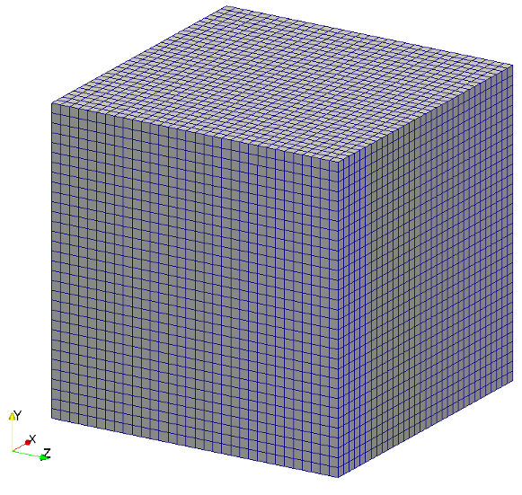

title: Fully periodic cube

Fully periodic cube is the most simplest mesh to generate by
defining most neccessary basic information for mesh like
bounding cube defining the universe, minlevel defining
minimum refinement level in the fluid domain and folder 
defines where to dump the fluid mesh in treelm format.

Example to generate the most simple mesh is given below,

```lua
-- This seeder configuration file shows an example for fully periodic cube
-- mesh with very basic mesh information i.e minlevel, folder and 
-- bounding cube
-- ------------------------------------------------------------------------- --

-- Location to write the mesh in.
-- Note the trailing path seperator, needed, if all mesh files should be in a
-- directory. This directory has to exist before running Seeder in this case!
folder = 'mesh/'

-- Some comment, you might want to put into the mesh file for later reference.
comment = 'Simple Sample Seeder Mesh'

-- Debug output can be used to output prelimnary tree in restart format
-- and this restart file can be converted to vtk format by Harvester
debug = { debugMode = true, debugFiles = false, debugMesh = 'debug/' }

-- A minimum level, by which all parts in the computational domain should at
-- least be resolved with. Default is 0.
minlevel = 3

-- Bounding cube: the root node of the octree, defining the complete universe,
-- from which all elements are derived by recursive bisection.
-- The origin is the corner from which on the cube is spanned with the given
-- length in each direction.
bounding_cube = { origin = {-1.0, -1.0, -1.0},
                  length = 2.0 }

spatial_object = {
  { 
    attribute = { kind = 'seed'},
    geometry = { 
      kind = 'canoND',
      object = {
        origin = { 0.0, 0.0, 0.0, },
	vec = {{2.8, 3.9, 4.2},{3.1,3.4,5.2}} 
     }
    }
  }
} 
```     

Image below shows the output mesh of fully periodic cube.


