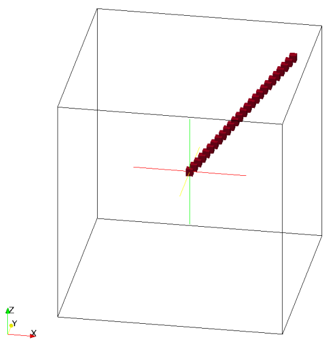
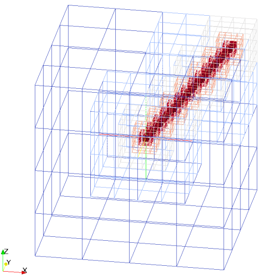

title: Line

Lines are defined in the configuration file through canonical 
geometry kind with an origin and vector defining the length
and direction of the line.

Valid definition:

* Single line
```lua
geometry = {
  kind = 'canoND',
  object = { 
    origin = { 0.0,0.0,0.0 },
    vec = { 2.0,0.0,0.0 }
  }
}
```

* Multiple line
```lua
geometry = {
  kind = 'canoND',
  object = {
    { 
    origin = { 0.0,0.0,0.0 },
    vec = { 2.0,0.0,0.0 }
    },
    { 
    origin = { 1.0,0.0,0.0 },
    vec = { 0.0,2.0,0.0 }
    },
  }
}
```

Seeder file to generate the mesh with line is generated using above canonical
geometry kind and the code is given below:

```lua
-- This is the standard seeder configuration, that should document the possible
-- and required configuration options.
-- It should always run out of the box!
-- ------------------------------------------------------------------------- --

-- Location to write the mesh in.
-- Note the trailing path seperator, needed, if all mesh files should be -- in a  directory. This directory has to exist before running Seeder in 
-- this case!
folder = 'mesh/'

-- Some comment, you might want to put into the mesh file for later 
-- reference.
comment = 'Simple Sample Seeder Mesh'

-- Debug output can be used to output preliminary tree in restart format
-- and this restart file can be converted to vtu format by Harvester
debug = { debugMode = true, debugFiles = false, debugMesh = 'debug/' }

-- Bounding cube: the root node of the octree, defining the complete universe,
-- from which all elements are derived by recursive bisection.
-- The origin is the corner from which on the cube is spanned with the given
-- length in each direction.
bounding_cube = { origin = {-1.0, -1.0, -1.0},
                  length = 2.0 }

-- A minimum level, by which all parts in the computational domain should at
-- least be resolved with. Default is 0.
minlevel = 6

-- *********************** Table of spatial objects *********************** --
-- Each spatial object is defined by an attribute and some geometric entity
-- attached to this attribute. Attributes might be defined multiple times.
-- Attributes are described by a kind (boundary, seed or refinement), a level
-- and maybe further kind specific values, like a label for the boundary.
-- Geometric objects might by right now:
-- - canoND (point, line, plane or box)
-- - STL
-- - Sphere
-- - Cylinder
--
-- Periodic boundaries are special, spatial objects of this kind can only make
-- use of geometric objects of the kind 'periodic'.
spatial_object = {
  {
    -- Defining a domain boundary
    attribute = { kind = 'boundary', -- or seed, refinement
                  label = 'solid',   -- some label to identify the boundary
                                     -- condition
                  level = 1          -- level to refine this object with,
                                     -- default = 0
                },
-- Example for line
-- It is also possible to define multiple lines
    geometry = { 
      kind = 'canoND',
      object = {
        origin = {-1.0,0.0,0.0},
        vec = {0.0,2.0,0.0}
      }
    },
    -- Transformation of line
--    transformation = {
--      translation = {1.0,0.0,0.0},
--      deformation = {
--        { 0.0, 0.5*math.cos(45*math.pi/180), -0.5*math.sin(45*math.pi/180) },
--        { 0.0, 0.5*math.sin(45*math.pi/180), 0.5*math.cos(45*math.pi/180) },
--        { 0.5, 0.0, 0.0 }
--                    } -- rotate the line along x-axis in anti-clockwise 
                        -- direction
--                      -- and scale by 0.5
--    }
  },
  {
    -- Defining a seed to identify the part of the computational domain in
    -- the universe cube.
    attribute = { kind = 'seed' },
    geometry = { -- single point definition with a canoND object.
                 kind = 'canoND',
                 object = { origin = {-0.0, -1.0, -1.0} }
               }
  }

} -- end of spatial objects
-- ************************************************************************ --
```

The mesh generated with line inside mesh:

 


Example lua file is available at `testsuite/line/seeder.lua`.
