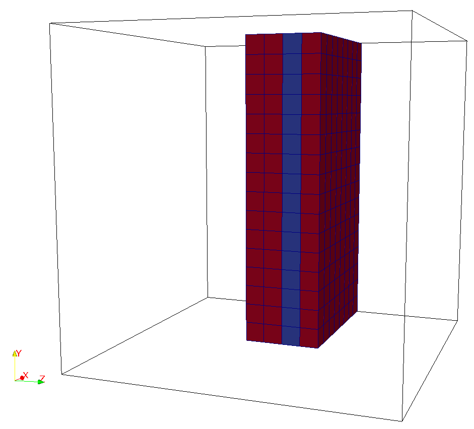
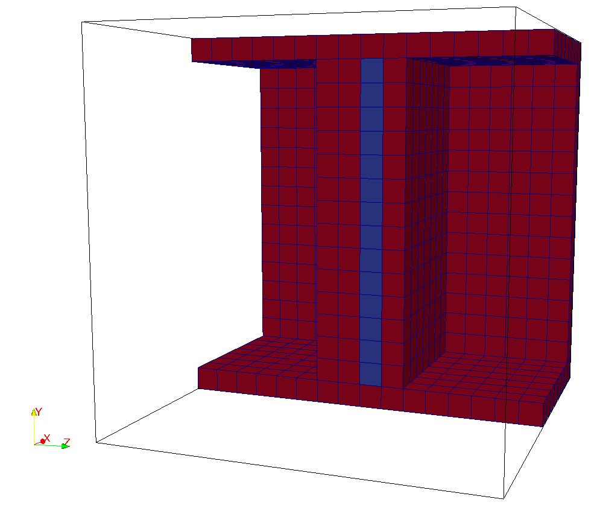
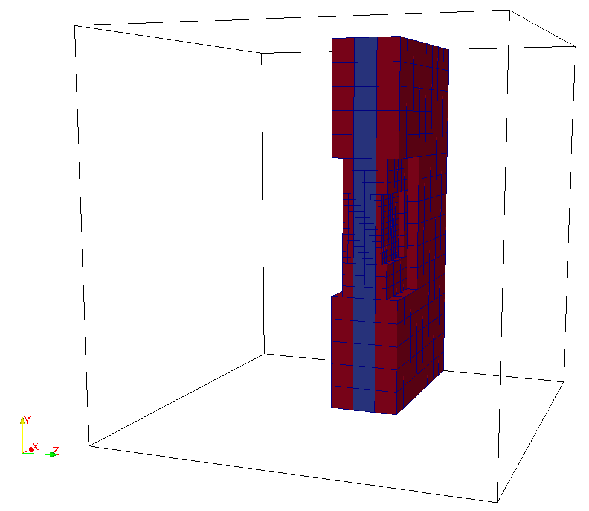
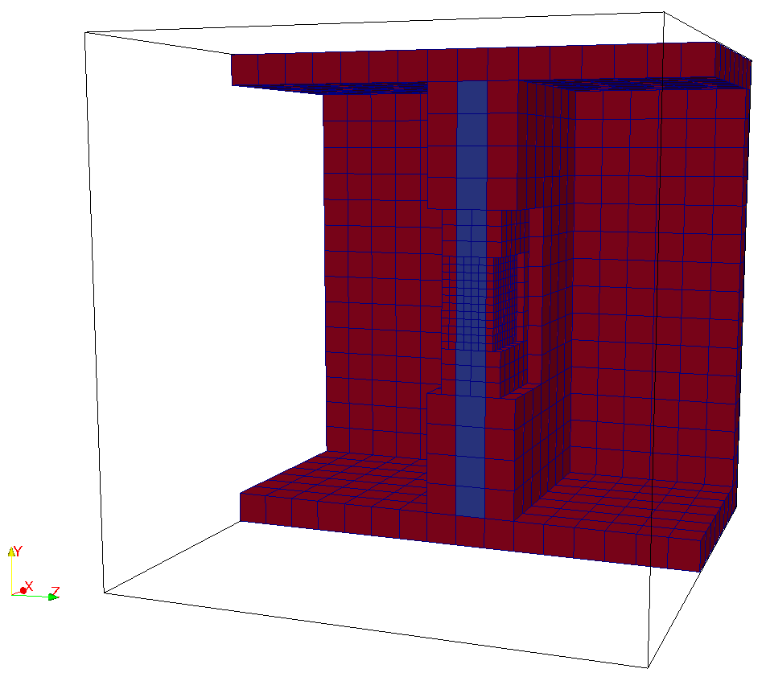

title: How to define periodic planes in lua file?

* There are some Pre-conditions to satisfy to define periodic planes, 
 look at "How periodic boundaries are created in seeder?"
* No need to specify any *bclabel* for periodic planes.
* No need to specify periodic boundary in the solver configuration 
  file since they are treated explicitly while building the neighbor array.

In the example below, the following variables are fixed.
```lua
length=1.0
-- minimum refinement level
minrefine = 1 
-- maximum refinement level
maxrefine = 4

-- mesh size
-- The offset distance between periodic planes dx is computed from 
-- the maximum refinement level.
dx=2.*length/(2^maxrefine)

-- bounding box defining the complete domain
bounding_cube = {origin = {-length,-length,-length},
               length = 2.*length}

```

* Single-level

  Creating a geometry with periodic planes in z.direction with only one fluid element between the periodic planes. 

* Single periodic plane in z-direction

```lua
spatial_object={
  attribute = {
    kind = 'boundary',
    level = 1
  },
  geometry = {
    kind = 'periodic',
    object = {
       plane1={
         origin = {-length,-length,dx+dx/2.},
         vec = { {2.*length,0.0,0.0},
                 {0.0,2.*length,0.0}
               }
       },
       plane2={
         origin = {-length,-length,-dx},
         vec = { {0.0,2.*length,0.0},
                 {2.*length,0.0,0.0}
               }
      }
    }
  }
}
```



* Multiple periodic planes

```lua
spatial_object={
{
  attribute = {
    kind = 'boundary',
    level = 1
  },
  geometry = {
    kind = 'periodic',
    object = {
       plane1={
         origin = {-length,-length,dx+dx/2.},
         vec = { {2.*length,0.0,0.0},
                 {0.0,2.*length,0.0}
               }
       },
       plane2={
         origin = {-length,-length,-dx},
         vec = { {0.0,2.*length,0.0},
                 {2.*length,0.0,0.0}
               }
      }
    }
  }
},
{
  attribute = {
    kind = 'boundary',
    level = 1
  },
  geometry = {
    kind = 'periodic',
    object = {
       plane1={
         origin = {length,-length,-length},
         vec = { {0.0,2.*length,0.0},
                 {0.0,0.0,2.*length}
               }
       },
       plane2={
         origin = {-length,-length,-length},
         vec = { {0.0,0.0,2.*length},
                 {0.0,2.*length,0.0}
               }
      }
    }
  }
},
{
  attribute = {
    kind = 'boundary',
    level = 1
  },
  geometry = {
    kind = 'periodic',
    object = {
       plane1={
         origin = {-length,length,-length},
         vec = { {0.0,0.0,2.*length},
                 {2.*length,0.0,0.0}
               }
       },
       plane2={
         origin = {-length,-length,-length},
         vec = { {2.*length,0.0,0.0},
                 {0.0,0.0,2.*length}
               }
      }
    }
  }
}
}
```



* Multi-level

  For multi-level periodic planes, the minimum offset distance _dxmin_ is computed from the maximum refinement level in the refinement box such that
  periodic planes are aligned perfectly parallel to each other as shown in the figure below. Two refinement box are used in this example-

```lua 

length=2.0
-- minimum refinement level
minrefine = 4 
-- maximum refinement level
maxrefine = minrefine + 3

-- mesh size
-- The offset distance between periodic planes dx is computed from 
-- the maximum refinement level.
dx=length/(2^minrefine)
dxmin=length/(2^maxrefine)

-- Location to write the mesh in.
-- Note the trailing path seperator, needed, if all mesh files should be in a
-- directory. This directory has to exist before running Seeder in this case!
folder= 'mesh/'

-- Debug output can be used to output preliminary tree in restart format
-- and this restart file can be converted to vtu format by Harvester

debug = {debugMode=true, debugFiles=true, debugMesh='debug/'}

-- bounding box defining the complete domain
bounding_cube = {origin = {-length/2,-length/2,-length/2},
                 length = length}

-- refinebox: three entries: origin, length and refinementlevel
spatial_object={
{
  attribute = {
    kind = 'refinement',
    level = maxrefine
  },
  geometry = {
    kind = 'canoND',
    object = {
      origin = {-0.25/2, -0.25/2., dxmin/2},
       vec = { {0.5/2,0.0,0.0},
               {0.0,0.5/2,0.0},
               {0.0,0.0,dx-dxmin}
             }
    }
  }
},
{
  attribute = {
    kind = 'refinement',
    level = maxrefine-1
  },
  geometry = {
    kind = 'canoND',
    object = {
      origin = {-0.25, -0.25, dxmin/2},
       vec = { {0.5,0.0,0.0},
               {0.0,0.5,0.0},
               {0.0,0.0,dx-dxmin}
             }
    }
  }
},
 -- Defining a seed to identify the part of the computational domain in
 -- the universe cube.

{ 
	attribute = { kind = 'seed',},
	geometry 	= { kind = 'canoND',
								object ={origin = {0.0,0.0,dx/2}
		}
	}
},


}

table.insert(spatial_object,{
  attribute = {
    kind = 'boundary',
    level = minrefine
  },
  geometry = {
    kind = 'periodic',
    object = {
       plane1={
         origin = {-length/2,-length/2,dx+dxmin/2.},
         vec = { {length,0.0,0.0},
                 {0.0,length,0.0}
               }
       },
       plane2={
         origin ={-length/2,-length/2,-dxmin/2},
         vec = { {0.0,length,0.0},
                 {length,0.0,0.0}
               }
      }
    }
  }
})

```



* Multiple periodic planes

```lua
-- Location to write the mesh in.
-- Note the trailing path seperator, needed, if all mesh files should be in a
-- directory. This directory has to exist before running Seeder in this case!
folder = 'mesh/'

-- Some comment,you might want to put into the mesh file for later reference.
comment = 'multipleperiodicplanes'

-- Debug output can be used to output preliminary tree in restart format
-- and this restart file can be converted to vtu format by Harvester
debug = { debugMode = true, debugFiles = false, debugMesh = 'debug/' }

length=1.0

--minimum refinement level
minrefine = 1 
-- maximum refinement level
maxrefine = 4

-- mesh size
-- The offset distance between periodic planes dx is computed from 
-- the maximum refinement level.
dx=2.*length/2^(maxrefine)

-- bounding box defining the complete domain
bounding_cube = {origin = {-length,-length,-length},
               length = 2.*length}

spatial_object={
 
{
  attribute = {
    kind = 'boundary',
    level = 4
  },
  geometry = {
    kind = 'periodic',
    object = {
       plane1={
         origin = {-length,-length,dx+dx/2.},
         vec = { {2.*length,0.0,0.0},
                 {0.0,2.*length,0.0}
               }
       },
       plane2={
         origin = {-length,-length,-dx},
         vec = { {0.0,2.*length,0.0},
                 {2.*length,0.0,0.0}
               }
      }
    }
  }
},
{
  attribute = {
    kind = 'boundary',
    level = 4
  },
  geometry = {
    kind = 'periodic',
    object = {
       plane1={
         origin = {length,-length,-length},
         vec = { {0.0,2.*length,0.0},
                 {0.0,0.0,2.*length}
               }
       },
       plane2={
         origin = {-length,-length,-length},
         vec = { {0.0,0.0,2.*length},
                 {0.0,2.*length,0.0}
               }
      }
    }
  }
},
{
  attribute = {
    kind = 'boundary',
    level = 4
  },
  geometry = {
    kind = 'periodic',
    object = {
       plane1={
         origin = {-length,length,-length},
         vec = { {0.0,0.0,2.*length},
                 {2.*length,0.0,0.0}
               }
       },
       plane2={
         origin ={-length,-length,-length},
         vec = { {2.*length,0.0,0.0},
                 {0.0,0.0,2.*length}
               }
      }
    }
  }
},
{
 -- Defining a seed to identify the part of the computational domain in
 -- the universe cube.
 -- single point definition with a canoND object.
   
 attribute = { kind = 'seed' },
    geometry = {
                 kind = 'canoND',
                 object = { origin = {0.,0.,dx*0.5} } 
               }
       }
}


```



Example for multiple periodic planes is availabe at
`testsuite/multiPeriodic/seeder.lua`
