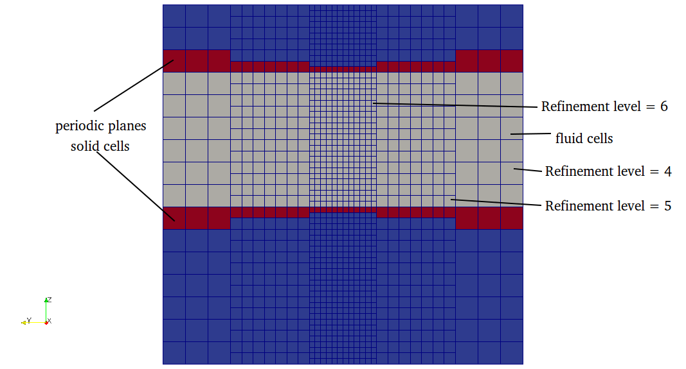

title: Periodic planes

The periodic boundary condition are used to represent the domain 
with infinite length, which is used when the simulation domain is too long.
It can be used to reduce the simulation domain from higher dimension 
to lower dimension for example 3D to 2D or 3D to 1D.
On the periodic boundary, the velocity at the outlet is copied to 
the velocity at the inlet and vice versa. 

Periodic planes are used to define perodic boundary in the mesh.
Periodic plane table contains two planes, plane1 and plane2 i.e
fluid neighbor of plane1 is mapped to plane2 and vice versa. 
Following conditions must be satisfied in defining periodic planes

* normal direction of plane1 and plane2 should point outwards
  fluid domain. 

  In seeder, the plane normals are 
  defined by <b> right hand rule</b>, where thump finger represents 
  the 1st vector and index finger represents the 2nd vector and middle finger
  represents the normal direction. This right hand rule can be seen perfectly 
  in the left plane in the figure below.

  

  Above image shows the normal directions for two planes pointing outwards 
  the fluid domain.
  Normal direction of the plane can be changed by just swaping the vectors
  defining planes.i.e order of vector as shown in image below.

  

* refinement level on both planes should be the same and there should not
  be any level jump on the periodic planes as shown below.

  

  Correct plane definition should look like below

  

  This can be achieved by shifting the plane by half of element size of
  maximum refinement level intersecting the periodic planes.\n

  <b> If any of the above condition is not satisfied then seeder will 
  terminate an error message. </b>

In seeder, when the node intersect only with periodic planes then the 
boundary id for that direction is set to huge number. So any node 
with direction of boundary id greater than number of boundaries then
the following algorithm is used for that direction.

## Algorithm used to generate the periodic boundary

* Find the barycenter of the current element with periodic neighbor
* Find the intersected periodic plane id and its assosiated opposite
  plane id in the growing array of periodic planes. (periodic
  plane definition is needed to project coordinate point from one plane
  to another and also the normal direction to get to the fluid domain)
* Project the barycenter of current element on its neighbor periodic 
  plane
* Translate the projected point to the opposite plane
* Use the current search direction to move to the fluid node.
* get the treeID of that node and set negative of this treeID to boundary id
  for current direction.
* if the fluid node is intersected by a boundary then set boundary id
  to minimun of intersected boundary.
* if the fluid node is again intersected by periodic boundary,
  then move in the negative normal direction of opposite periodic plane
  and do step 3 and 4.
    
 
In the solver, the periodic boundaries are identified with the boundary
id with negative values.

[How to define periodic planes in lua file?](per_plane_example.html)

Example lua file to generate Channel with one element in z-direction
is available in the repository at:
`testsuite/periodic/seeder.lua`
