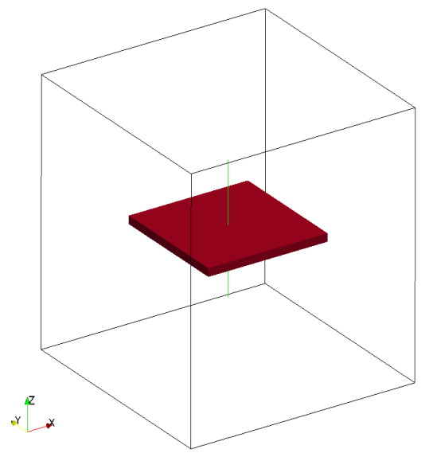
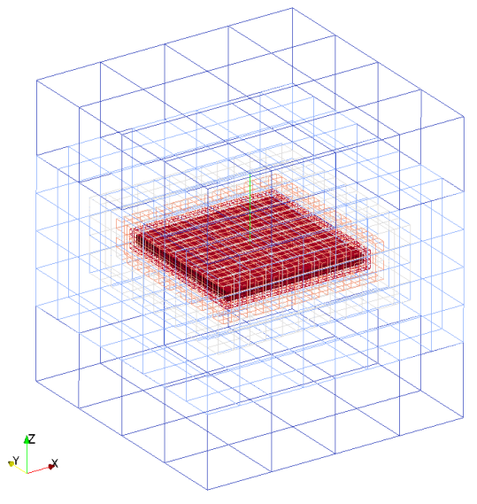
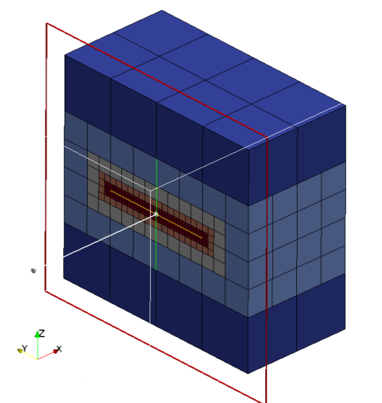

title: Plane

Planes are defined by an origin and two vectors.
Internally in the code, planes are converted into two triangles.

```  
vec2____________ 
/\              |
|               |
|               |
|               |
|               |
|-------------->|
origin      vec1 
``` 

Defintion:
```lua
spatial_object={
    attribute = {
      kind = 'boundary',
      label = 'plane1',
    },
    geometry = {
      kind = 'canoND',
      object = {
        origin={2.0,-1.0,-1.0},
        vec={{0.0,2.0,0.0},
             {0.0,0.0,2.0}},
      }
    }
}
```

Seeder file to generate the mesh with plane is given below:
```lua
-- Geometry definition

height =  0.41
length = height
-- Use this file as template. Do not modify this file for running some testcases

-- Location to write the mesh in
-- Note the trailing path seperator, needed, if all mesh files should be 
-- directory. This directory has to exist before running Seeder in this 
-- case
folder = 'mesh/' 

--A minimum level,by which all parts in the computational domain should
--at least be resolved with .Default is 0
minlevel  = 6

--Debug output can be used to output preliminary tree in restart format
--and this restart file can be converted to vtu format by harvester. 
debug = {debugMode = true, debugFiles = true, debugMesh = 'debug/'}


-- boundingbox: two entries: origin and length in this
-- order, if no keys are used
bounding_cube = {origin = {-length, -length, -length},
               length = length*2.0}

-- Each spatial object is defined by an attribute and some geometric
-- entity attached to this attribute. Attribute might be defined mulitple-- times.
-- Attributes are described by a kind (boundary ,seed or Refinement)
--  a level
spatial_object = {
  { attribute = { kind = 'seed', },

-- Geometric objects might by right now:
-- canoND (point, line, plane or box)
-- STL
    geometry = { kind = 'canoND',
                 object = { origin = { 0.0, 0.0, 0.0 },
               }
    } -- geometry
  }, -- seed
  {

  -- Four edges bounding the plane (east, west, north and south)
  -- this is for the lable' east'
    attribute = {    
      kind = 'boundary',
      label='east'           
    },

  -- for define the box object requires the origin and vector 
    geometry = {
      kind = 'canoND',
      object = {
        origin = {length*0.5, -length*0.5, -length*0.5},
        vec = {{0.0, length, 0.},
              {0.,0.0, length}}
      }
    }
  },
  {

 -- this is for label 'west'
      attribute = {
      kind = 'boundary',
      label='west'
    },
    geometry = {
      kind = 'canoND',
      object = {
        origin = {-length*0.5, -length*0.5, -length*0.5},
        vec = {{0.0, length, 0.},
              {0.,0.0, length}}
      }
    }
  },
  {
 -- this is for label 'North'
    attribute = {
      kind = 'boundary',
      label='north'
    },
    geometry = {
      kind = 'canoND',
      object = {
        origin = {-length*0.5, height*0.5, -length*0.5},
        vec = {{length, 0.0, 0.},
              {0.,0.0, length}}
      }
    }
  },  
  {
 -- this is for label 'South'
    attribute = {
      kind = 'boundary',
      label='south'
    },
    geometry = {
      kind = 'canoND',
      object = {
        origin = {-length*0.5,-height*0.5, -length*0.5},
        vec = {{length, 0.0, 0.},
              {0.,0.0, length}}
      }
    }
  }
}

```

The mesh generated with plane inside mesh:





Cut view of plane



Example lua file is available at `testsuite/plane/seeder.lua`.
