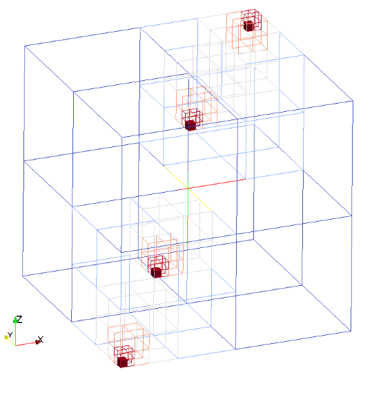

title: Points

Points are defined in the configuration file through canonoical 
geometry kind with an origin.

Valid definition:

* Single point
```lua
geometry = {
  kind = 'canoND',
  object = { 
    origin = { 0.0,0.0,0.0 }
  }
}
```

* Multiple point
```lua
geometry = {
  kind = 'canoND',
  object = {
    { 
    origin = { 0.0,0.0,0.0 }
    },
    { 
    origin = { 1.0,0.0,0.0 }
    },
  }
}
```

Seeder file to generate the mesh with multiple point obstacle is given below:
```lua
-- This seeder configuration file shows an example to create a point
-- ------------------------------------------------------------------------- --

-- Location to write the mesh in.
-- Note the trailing path seperator, needed, if all mesh files should be in a
-- directory. This directory has to exist before running Seeder in this case!
folder = 'mesh/'

-- Some comment, you might want to put into the mesh file for later reference.
comment = 'Simple Sample Seeder Mesh'

-- Debug output can be used to output prelimnary tree in restart format
-- and this restart file can be converted to vtu format by Harvester
-- debug = { debugMode = true, debugMesh = 'debug/' }
-- Bounding cube: the root node of the octree, defining the complete universe,
-- from which all elements are derived by recursive bisection.
-- The origin is the corner from which on the cube is spanned with the given
-- length in each direction.
bounding_cube = { origin = {-1.0, -1.0, -1.0},
                  length = 2.0 }

-- A minimum level, by which all parts in the computational domain should at
-- least be resolved with. Default is 0.
 minlevel = 6

-- *********************** Table of spatial objects *********************** --
-- Each spatial object is defined by an attribute and some geometric entity
-- attached to this attribute. Attributes might be defined multiple times.
-- Attributes are described by a kind (boundary, seed or refinement), a level
-- and maybe further kind specific values, like a label for the boundary.
 spatial_object = {
  {
    -- Defining a domain boundary
    attribute = { kind =  'boundary',     -- or seed, refinement
                  label = 'CornerPoint',  -- some label to identify the boundary
                                          -- condition
    },
        geometry = {                      -- points created inside domain
        kind = 'canoND',
        object = {{
        origin = { -1.0,-1.0,-1.0} 
        },
        {
        origin = { 0.9,0.9,0.9}
        }
      }
   }
  },
  {
    -- Defining a domain boundary
    attribute = { kind = 'boundary', -- or seed, refinement
                  label = 'Inside',  -- some label to identify the boundary
                                     -- condition
                  level = 1          -- level to refine this object with,
                                     -- default = 0
    },
    geometry = { 
        kind = 'canoND',
        object = {{                    -- 2 more points created inside domain
        origin = { -0.5,-0.5,-0.5} 
        },
        {
        origin = { 0.0,0.0,0.5}
        }
      }
   }
  },

  {
    -- Defining a seed to identify the part of the computational domain in
    -- the universe cube.
    attribute = { kind = 'seed' },
    geometry =  { -- single point definition with a canoND object.
                 kind = 'canoND',
                 object = { origin = {-0.0, -0.0, -0.0} }
                }
  }

} -- end of spatial objects
-- ************************************************************************ --
```

The image generated with multiple point obstacles from the above code:


Example lua file is available at `testsuite/point/seeder.lua`
