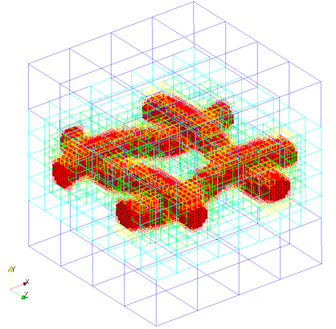

title: Spacers

Spacers are defined by an two spacer filaments one along the length and 
other along the width. Each spacer filament is defined by the \ref cylinders
and distance between consecutive spacer filaments

Valid definition:
```lua
geometry={
  kind='spacer', 
    object={
      length={
        origin = {0.0,0.0,0.0}, -- starting point of the spacer
        vec = {1.0,0.0,0.0}, -length and axis of first filament
        radius = 0.001 -- radius of the filament
        only_surface = true, -- If not defined default is set to false
        filament_gap = 0.02, -- distance between filament
      },
      width={
        origin = {0.0,0.0,0.0}
        vec = {0.0,0.0,1.0},
        radius = 0.001,
        only_surface = true, -- If not defined default is set to false
        filament_gap = 0.02,
      },
      interwoven = true, --switch between interwoven and non-interwoven
                        -- spacer generation
    }
} -- single spacer
```

The following seeder file is to generate mesh with spacer inside:
```lua
-- This is the standard seeder configuration, that should document the possible
-- and required configuration options.
-- It should always run out of the box!
-- ------------------------------------------------------------------------- --

-- Location to write the mesh in.
-- Note the trailing path seperator, needed, if all mesh files should be in a
-- directory. This directory has to exist before running Seeder in this case!
folder = 'mesh/'

-- Some comment, you might want to put into the mesh file for later reference.
comment = 'Simple Sample Seeder Mesh'

-- Debug output can be used to output prelimnary tree in restart format
-- and this restart file can be converted to vtu format by Harvester
debug = { debugMode = true, debugMesh = 'debug/' }

-- Bounding cube: the root node of the octree, defining the complete universe,
-- from which all elements are derived by recursive bisection.
-- The origin is the corner from which on the cube is spanned with the given
-- length in each direction.
bounding_cube = { origin = {-1.0, -1.0, -1.0},
                  length = 2.0 }

-- A minimum level, by which all parts in the computational domain should at
-- least be resolved with. Default is 0.
minlevel = 6

-- *********************** Table of spatial objects *********************** --
-- Each spatial object is defined by an attribute and some geometric entity
-- attached to this attribute. Attributes might be defined multiple times.
-- Attributes are described by a kind (boundary, seed or refinement), a level
-- and maybe further kind specific values, like a label for the boundary.
-- Geometric objects might by right now:
-- - canoND (point, line, plane or box)
-- - STL
-- - Sphere
-- - Cylinder
--
-- Periodic boundaries are special, spatial objects of this kind can only make
-- use of geometric objects of the kind 'periodic'.
spatial_object = {
  {
    -- Defining a domain boundary
    attribute = { kind = 'boundary', -- or seed, refinement
                  label = 'solid',   -- some label to identify the boundary
                                     -- condition
                  level = 1          -- level to refine this object with,
                                     -- default = 0
                },
    -- Example for spacer
    geometry = {                  -- defining the geometry of the spacer
      kind = 'spacer',
      object = {
        length = {
          vec = {2.0,0.0,0.0},
          filament_gap = 1.0,
          radius = 0.10,
          origin = {-1.0,0.0,-1.0+1.0/2}
        },
        width = { 
          vec = {0.0,0.0,2.0},
          filament_gap = 1.0,
          radius = 0.10,
          origin = {-1.0+1.0/2,0.0,-1.0}
        },
          interwoven = true
      }
    }
  },
  -- Example for rotated spacer
--    geometry = {
--      kind = 'spacer',
--      object = {
--        length = {
--         -- rotated along x-axis 60 angle
--          vec = {8.0*math.cos(60*math.pi/180),0.0,8.0*math.sin(60*math.pi/180)},
--          filament_gap = 1.0,
--          radius = 0.1,
--          origin = {-0.0,0.0,-4.0}
--        },
--        width = { 
--         -- rotated along z-axis 30 angle
--          vec = {8.0*math.sin(-30*math.pi/180),0.0,8.0*math.cos(-30*math.pi/180)},
--          filament_gap = 1.0,
--          radius = 0.1,
--          origin = {-0.0,0.0,-4.0}
--        },
--          interwoven = false
--      }
--    }
--  },

  {
    -- Defining a seed to identify the part of the computational domain in
    -- the universe cube.
    attribute = { kind = 'seed' },
    geometry = { -- single point definition with a canoND object.
                 kind = 'canoND',
                 object = { origin = {-0.0, -1.0, -1.0} }
               }
  }

} -- end of spatial objects
-- ************************************************************************ --
```

Mesh generated with above seeder file:



Example lua file is available at `testsuite/spacer/seeder.lua`.
