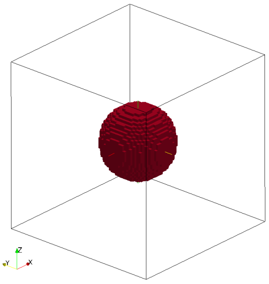
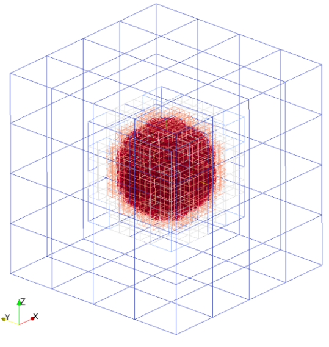
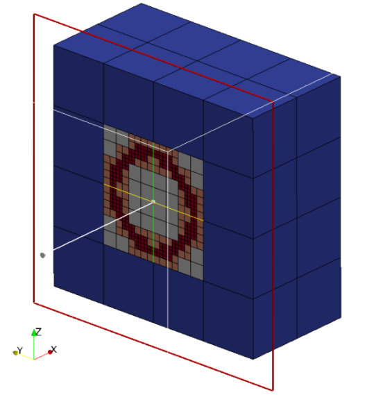
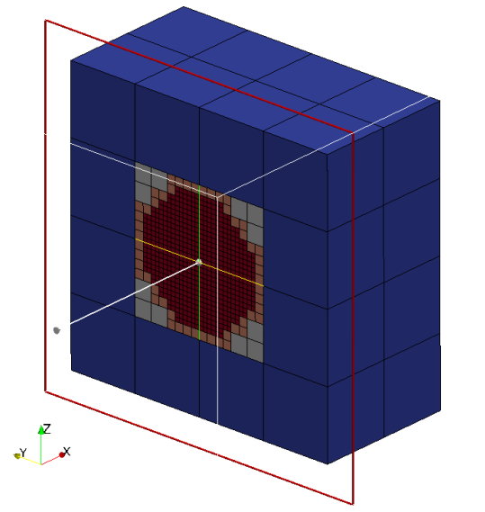

title: Sphere

Spheres are defined by an origin and radius.
Sphere is considered to be solid as default i.e. all the cubes inside the
sphere are marked as intersected cubes. 
It is possible to created hollow spheres by setting `only_surface = true`,
it will mark only the cubes intersect with sphere surface as intersected
cubes

Valid definition:

* Single sphere
```lua
geometry={
  kind='sphere', 
    object={
      origin={0.0,0.0,0.0},
      radius=0.25,
      only_surface = true, -- If not defined default is set to false
    }
}
```

* Multiple sphere
```lua
geometry={
  kind='sphere', 
    object={
      {
      origin={0.0,0.0,0.0},
      radius=0.25
      },
      {
      origin={-2.0,0.0,0.0},
      radius=0.25
      }
    }
} 
```

The following seeder file is to generate mesh with hollow sphere (hollow => `only_surface=true`) inside:
```lua
-- This is the standard seeder configuration, that should document the possible
-- and required configuration options.
-- It should always run out of the box!
-- ------------------------------------------------------------------------- --

-- Location to write the mesh in.
-- Note the trailing path seperator, needed, if all mesh files should be in a
-- directory. This directory has to exist before running Seeder in this case!
folder = 'mesh/'

-- Some comment,you might want to put into the mesh file for later reference.
comment = 'Simple Sample Seeder Mesh'

-- Debug output can be used to output preliminary tree in restart format
-- and this restart file can be converted to vtu format by Harvester
debug = { debugMode = true, debugFiles = false, debugMesh = 'debug/' }

-- Bounding cube: the root node of the octree, defining the complete universe,
-- from which all elements are derived by recursive bisection.
-- The origin is the corner from which on the cube is spanned with the given
-- length in each direction.
bounding_cube = { origin = {-1.0, -1.0, -1.0},
                  length = 2.0 }

-- A minimum level, by which all parts in the computational domain should at
-- least be resolved with. Default is 0.
minlevel = 5

-- *********************** Table of spatial objects *********************** --
-- Each spatial object is defined by an attribute and some geometric entity
-- attached to this attribute. Attributes might be defined multiple times.
-- Attributes are described by a kind (boundary, seed or refinement), a level
-- and maybe further kind specific values, like a label for the boundary.
-- Geometric objects might by right now:
-- - canoND (point, line, plane or box)
-- - STL
-- - Sphere
-- - Cylinder
--
-- Periodic boundaries are special, spatial objects of this kind can only make
-- use of geometric objects of the kind 'periodic'.
spatial_object = {
  {
    -- Defining a domain boundary
    attribute = { kind = 'boundary', -- or seed, refinement
                  label = 'solid',   -- some label to identify the boundary
                                     -- condition
                  level = 1          -- level to refine this object with,
                                     -- default = 0
                },
   -- Defining Geometry of the sphere
    geometry = {
      kind = 'sphere',
      object = {
        {
        radius = 0.2,
        origin = {0.0,0.0,0.0}, -- origin of the sphere
        only_surface = true       -- Use only surface of the object?
                                             -- default is: false.
        }
--       ,{
--        radius = 0.1,
--        origin = {-1.0,0.0,0.0}
--        }  
              }  
              }  
  },
  {
    -- Defining a seed to identify the part of the computational domain in
    -- the universe cube.
    attribute = { kind = 'seed' },
    geometry = { -- single point definition with a canoND object.
                 kind = 'canoND',
                 object = { origin = {-0.0, -1.0, -1.0} } -- origin of the cube for the defining the 'seed'
               }
  }
}
-- ------------------------------------------------------------------------ --

```

Mesh generated with hollow sphere by the seeder file:




Cutview of mesh with hollow sphere:



Cutview of mesh with solid sphere (solid => `only_surface=false`):



Example lua file is available at `testsuite/sphere/seeder.lua`
