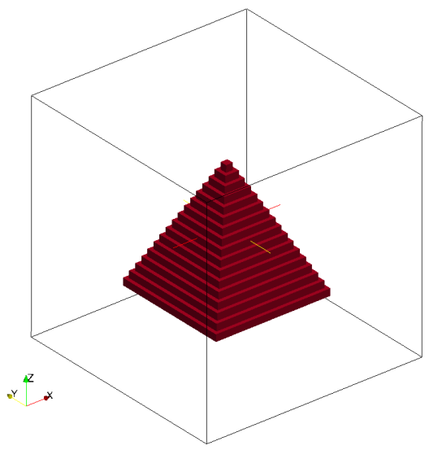
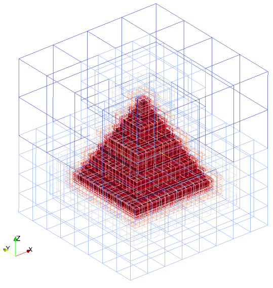

title: Triangle

Triangles are defined by three nodes. It is possible to define triangles
as a geometry kind. Also, the planes and hollow boxes are converted to
triangles internally.

Valid definition:

* Single triangle
```lua
geometry={
  kind='triangle', 
    object={
      nodes = {             -- triangle 1
        {0.0, 0.0, 0.5},    -- node 1
        {-0.5, -0.5, -0.5}, -- node 2
        {0.5, -0.5, -0.5}      -- node 3
      }  
    }
}
```

* Multiple triangles
```lua
geometry={
  kind='triangle', 
    object={
      {
        nodes = {             -- triangle 1
          {0.0, 0.0, 0.5},    -- node 1
          {-0.5, -0.5, -0.5}, -- node 2
          {0.5, -0.5, -0.5}      -- node 3
        }
      },
      {
        nodes = {             -- triangle 2
          {0.0, 0.0, 0.5},    -- node 1
          {-0.5, -0.5, -0.5}, -- node 2
          {-0.5, 0.5, -0.5}      -- node 3
        }
      }
    }
} 
```

A pyramid has created with four triangles and a plane. The corresponding
seeder code is given below:
```lua
-- This is the standard seeder configuration, that should document the possible
-- and required configuration options.
-- It should always run out of the box!
-- ------------------------------------------------------------------------- --

-- Location to write the mesh in.
-- Note the trailing path seperator, needed, if all mesh files should be in a
-- directory. This directory has to exist before running Seeder in this case!
folder = 'mesh/'

-- Some comment, you might want to put into the mesh file for later reference.
comment = 'Simple Sample Seeder Mesh'

-- Debug output can be used to output prelimnary tree in restart format
-- and this restart file can be converted to vtu format by Harvester
debug = { debugMode = true, debugMesh = 'debug/' }
logging = {level=3}
timing_file = 'timing.res'

-- Bounding cube: the root node of the octree, defining the complete universe,
-- from which all elements are derived by recursive bisection.
-- The origin is the corner from which on the cube is spanned with the given
-- length in each direction.
bounding_cube = { origin = {-1.0, -1.0, -1.0},
                  length = 2.0 }

-- A minimum level, by which all parts in the computational domain should at
-- least be resolved with. Default is 0.
minlevel = 6

--smoothbounds = false
--smoothlevels = true

-- *********************** Table of spatial objects *********************** --
-- Each spatial object is defined by an attribute and some geometric entity
-- attached to this attribute. Attributes might be defined multiple times.
-- Attributes are described by a kind (boundary, seed or refinement), a level
-- and maybe further kind specific values, like a label for the boundary.
-- Geometric objects might by right now:
-- - canoND (point, line, plane or box)
-- - STL
-- - Sphere
-- - Cylinder
--
-- Periodic boundaries are special, spatial objects of this kind can only make
-- use of geometric objects of the kind 'periodic'.
spatial_object = {
  {
    -- Defining a domain boundary
    attribute = { 
      kind = 'boundary', -- or seed, refinement
      label = 'solid',   -- some label to identify the boundary
                         -- condition
      level = 1,          -- level to refine this object with,
      -- Distance refinement
      NOdistance_refine = {
        {
          radius = 0.2,
          level_offset = 0
        },
        {
          radius = 0.5,
          level_offset = -1
        }
      }

                         -- default = 0
    },
    geometry = { -- Example for a triangle definition
      {           -- Here: Pyramid is defined by 4 triangles
        kind = 'triangle',
        object = {
          { 
            nodes = {             -- triangle 1
              {0.0, 0.0, 0.5},    -- node 1
              {-0.5, -0.5, -0.5}, -- node 2
              {0.5, -0.5, -0.5}      -- node 3
            }
          },
          {
            nodes = {             -- triangle 2
              {0.0, 0.0, 0.5},    -- node 1
              {-0.5, -0.5, -0.5}, -- node 2
              {-0.5, 0.5, -0.5}      -- node 3
            }
          },
          {
            nodes = {             -- triangle 3
              {0.0, 0.0, 0.5},    -- node 1
              {-0.5, 0.5, -0.5}, -- node 2
              {0.5, 0.5, -0.5}      -- node 3
            }
          },  
          {
            nodes = {             -- triangle 4
              {0.0, 0.0, 0.5},    -- node 1
              {0.5,-0.5, -0.5}, -- node 2
              {0.5, 0.5,-0.5}      -- node 3
            }
          }  
        }
      },
      -- plane to close the pyramid bottom
      {
        kind = 'canoND',
        object = {
          origin = { -0.5,-0.5,-0.5},
          vec = {
            {1.0,0.0,0.0},
            {0.0,1.0,0.0}
          }  
        }
      }  
    }
  },
  {
    -- Defining a seed to identify the part of the computational domain in
    -- the universe cube.
    attribute = { kind = 'seed' },
    geometry = { -- single point definition with a canoND object.
                 kind = 'canoND',
                 object = { origin = {-0.0, -1.0, -1.0} }
               }
  }

} -- end of spatial objects
-- ************************************************************************ --
```

Mesh with pyramid generated by the seeder file:




